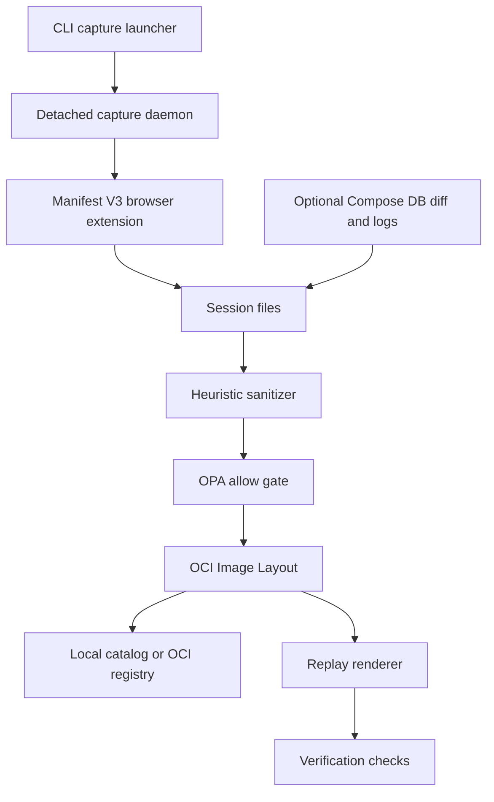

# Architecture

DAWG `0.2.3-naughty` captures a browser session through an extension, sanitizes supported JSONL streams, packages them as an OCI Image Layout, and renders the recording for replay and verification.

## Pipeline Overview



| Stage | Main responsibility |
|---|---|
| Capture | Record rrweb events, browser actions, frontend HTTP metadata, and optional environment inputs |
| Sanitize | Replace recognized secrets and PII in supported JSONL files, then evaluate a Rego allow decision |
| Package | Validate metadata and create content-addressed OCI layers |
| Store | Register locally, export/import a `.dawg` archive, or push/pull through an OCI registry |
| Replay | Restore available environment data and render the rrweb timeline in Playwright Chromium |
| Verify | Compare replay exit status and any available HTTP and screenshot outcomes |

## Capture

The current `dawg capture` path is extension-driven. Although the source tree contains other browser and proxy helpers, the CLI does not instantiate them for capture.

1. The short-lived CLI launcher creates a session and starts a detached engine daemon.
2. The daemon starts the extension server on `127.0.0.1:8082`.
3. The Manifest V3 extension connects with a token-bearing WebSocket handshake.
4. The extension selects a tab whose HTTP(S) URL exactly matches `--url`, or opens one.
5. `dawg capture stop` asks the extension to drain buffered data before finalization.
6. The daemon sanitizes the session, packages it, and adds it to the local catalog.

The extension requires Chrome 116 or newer and requests access to `<all_urls>`. It records only requests associated with the selected tab.

### Session Data

| Path | Contents |
|---|---|
| `traces/rrweb.jsonl` | rrweb DOM and interaction events |
| `actions/browser.jsonl` | Separate click and fill action records |
| `http/frontend.jsonl` | Frontend request headers/body and response status/headers |
| `env/compose.yaml` | Optional Compose snapshot |
| `env/lockfile.json` | Optional resolved environment lock data |
| `db/diff.jsonl` | Optional normalized ORM database-diff stream |
| `logs/structured.jsonl` | Optional structured JSON logs |

rrweb runs with `maskAllInputs: true`. The separate action stream can still contain entered values, so sanitization includes both streams. Frontend response bodies are not currently captured.

## Sanitization and Policy Gate

The sanitizer rewrites a fixed set of JSONL files in place through temporary files. It uses field-path and value heuristics for secrets, PII, and payment-card data. Email addresses, phone numbers, and names receive deterministic SHA-256-derived synthetic values; other detections become `[REDACTED]`.

After rewriting, the engine evaluates `data.dawg.sanitizer.allow`. The policy receives only redaction counters and blocked-field names—not the complete capture. Packaging requires an allowed `sanitize-report.json`.

This process reduces accidental exposure but does not establish that an artifact is free of confidential data. See [Sanitizer Policy](./sanitizer-policy.md) for the exact detection and policy boundaries.

## OCI Packaging

A packaged artifact is an OCI Image Layout:

```text
<artifact-directory>/
├── dawg-manifest.json
├── oci-layout
├── index.json
└── blobs/
    └── sha256/
        └── <digest>
```

The DAWG manifest is validated against `schema/manifest/v0.2.3-naughty.json`. It requires the schema version, SHA-256 artifact ID, creation time, non-empty title, source, at least one layer, sanitization metadata, determinism metadata, and expected outcome.

### Current Layer Types

| Concern | Media type | Packaging |
|---|---|---|
| Environment | `application/vnd.dawg.env.lockfile+tar` | Uncompressed tar |
| Database | `application/vnd.dawg.db.fixture+tar.zstd` | zstd-compressed tar |
| Trace | `application/vnd.dawg.trace.rrweb+jsonl.zstd` | zstd-compressed tar |
| Cassette | `application/vnd.dawg.cassette+tar.zstd` | zstd-compressed tar |

The trace layer groups `traces/`, `actions/`, `http/`, and `logs/`. Descriptors and blobs use SHA-256 content addressing.

Artifacts default to the state directory at `~/.dawg/artifacts/<timestamped-title>` unless `DAWG_STATE_DIR` changes the state root. The local catalog distinguishes captured and imported artifacts and can discover legacy artifacts. Portable `.dawg` exports are ZIP archives containing the OCI layout.

Import applies archive traversal, symlink, entry-count, size, compression-ratio, OCI-structure, descriptor, and digest validation before registration.

## Replay

Replay is a rendering pipeline rather than action re-execution:

1. Validate and unpack the OCI layers into a temporary directory.
2. Read the DAWG manifest.
3. Export `FAKETIME=@<clockFrozenAt>` when the recorded value is nonzero.
4. On supported non-Windows hosts, start `env/compose.yaml` with Docker Compose.
5. Restore `db/fixture.sql`, when present, into `<project>-db-1` with `pg_restore --data-only --no-owner --no-privileges -d postgres`.
6. Start `mitmdump` server replay with `--server-replay-kill-extra` when `cassettes/cassette.yaml` exists.
7. Use `engine/scripts/replay-browser.cjs` and Playwright Chromium to reconstruct the rrweb DOM timeline in a local replay page.
8. Wait for the trace duration plus two seconds, then write `outcome/screenshot.png` and diagnostics.

`FAKETIME` only affects a target environment that consumes it. A random seed is represented in the manifest types but is not applied during replay.

Recorded action events are not executed, and replay does not navigate or run through the original application's workflow. It visualizes the captured rrweb recording.

### Platform Boundaries

On non-Windows systems, Compose replay requires digest-pinned service images and rootless Docker. Windows currently skips sandbox startup and database restore. These differences mean environment replay is not equivalent across platforms.

## Verification

`dawg verify` runs replay first and always checks for replay exit code `0`. It then attempts available comparisons:

| Check | Current comparison |
|---|---|
| HTTP | Ordered response status codes only |
| Screenshot | Exact per-channel pixels; passes with at most 100 differing pixels |
| Replay | Process exit code equals `0` |

HTTP and screenshot comparison errors are currently omitted from the check list. Screenshot comparison is attempted only when the manifest has a non-empty `assertionFile`; captures currently write `"none"`, so a usable baseline may be absent and the screenshot check omitted.

The `--against` value is report metadata (`verifiedAgainst`) only. It does not select, check out, or execute another branch, commit, or path. A verification result of `fail` means the bug still reproduces.

## Repository Structure

```text
dawg/
├── version.json
├── engine/
│   ├── cmd/dawg/                 # Cobra command definitions
│   ├── internal/
│   │   ├── capture/
│   │   ├── dawgenv/
│   │   ├── dawgtypes/
│   │   ├── manifest/
│   │   ├── packager/
│   │   ├── procutil/
│   │   ├── registry/
│   │   ├── replay/
│   │   ├── sanitize/
│   │   └── verify/
│   └── scripts/replay-browser.cjs
├── extension/                    # Chrome Manifest V3 capture extension
├── desktop/
│   ├── src/                      # React UI
│   └── src-tauri/                # Tauri host
├── schema/
│   ├── manifest/v0.2.3-naughty.json
│   ├── mediatypes.json
│   └── policies/default.rego
├── tools/sync-versions.cjs
└── web/                          # VitePress documentation
```

## Toolchain

| Area | Technology | Version |
|---|---|---:|
| Engine | Go | 1.25.1 |
| CLI | Cobra | 1.9.1 |
| Policy | OPA | 0.70.0 |
| Registry | ORAS | 2.3.1 |
| Compression | klauspost/compress | 1.17.11 |
| Schema validation | jsonschema/v6 | 6.0.1 |
| Browser automation | Playwright | 1.55.1 |
| Recording | rrweb | 2.0.0-alpha.18 |
| Cassette replay | mitmproxy | 12.2.3 |
| JavaScript runtime | Node.js | 22.14.0 |
| Desktop | Tauri | 2 |
| Desktop UI | React | 19.1 |
| Desktop language | TypeScript | 5.8.3 |
| Desktop build | Vite | 7.0.4 |
| Styling | Tailwind CSS | 4.3.3 |
