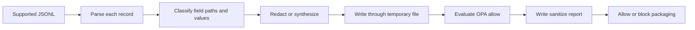

# Sanitizer Policy

DAWG `0.2.3-naughty` sanitizes supported capture streams before packaging and then evaluates an Open Policy Agent (OPA) allow decision. Detection is heuristic: sanitization reduces exposure, but it is not a confidentiality or no-leak guarantee.

## Processing Flow



The sanitizer processes these files when they exist:

- `http/frontend.jsonl`
- `http/backend.jsonl`
- `db/diff.jsonl`
- `logs/structured.jsonl`
- `traces/rrweb.jsonl`
- `actions/browser.jsonl`
- `cassettes/thirdparty.jsonl`

Other file formats are not sanitized by this pass. Each supported file is replaced only after its complete temporary output succeeds. Invalid JSONL aborts sanitization and leaves the original file intact.

## Detection Rules

The rule engine recursively inspects JSON field paths and string values. It uses its own fixed heuristics rather than an external secret-scanning rule set, and it does not redact every unmatched field.

### Sensitive Field Paths

A field is treated as sensitive when its normalized path contains one of these substrings:

- credentials and sessions: `password`, `authorization`, `cookie`, `token`, `secret`, `api_key`, `api-key`, `apikey`, `session`
- identity: `ssn`, `social_security`, `passport`, `national_id`, `tax_id`
- personal data: `date_of_birth`, `birthdate`, `address`

Email, phone, card, and name handling also uses field paths:

- email paths or anchored email values
- `phone` or `mobile` paths, or anchored phone values
- `card` or `credit` paths, or anchored payment-card values
- any non-structural path containing `name`

### Sensitive Values

String values are recognized as secrets when they match:

- the `Bearer ` prefix
- a JWT-like three-segment value
- an AWS access key ID
- a GCP API key
- a GitHub token
- a generic private-key header
- a Slack token

Email, phone, and card values have separate anchored patterns. There is no generic rule that treats every long alphanumeric string as a secret.

### Context and Structural Exceptions

To avoid corrupting rrweb structure, these path suffixes are preserved:

- `tagName`
- `nodeName`
- `localName`
- `fieldName`
- `inputType`
- `selector`

The sanitizer also preserves doctype `name` and SVG `viewBox` and `points` values.

For an action field named `value`, the associated `selector`, `fieldName`, and `inputType` are added to the classification context. This allows values from password-like action targets to be detected even though the generic structural keys remain unchanged.

A string-valued `body` field is recursively sanitized only when its contents parse as JSON. Non-JSON body strings receive ordinary field/value classification rather than recursive parsing.

## Replacement Behavior

| Category | Replacement |
|---|---|
| Email | `user_<8 lowercase hex>@example.com` |
| Phone | `+1555` followed by 7 deterministic digits |
| Name | `User <8 uppercase hex>` |
| Secrets, cards, and other sensitive values | `[REDACTED]` |

Email, phone, and name replacements are deterministic SHA-256-derived values based on the category and original value. The same category and input produce the same replacement. Payment-card data is not format-preserving.

Only email, phone, and name classifications produce synthetic values. Deterministic replacement can preserve some application behavior, but it does not guarantee that every application-specific validation rule will accept the result.

## OPA Policy Gate

The engine evaluates exactly this decision:

```text
data.dawg.sanitizer.allow
```

A custom policy must therefore declare this package:

```text
package dawg.sanitizer
```

OPA does not receive the complete sanitized capture. Its input is limited to:

```json
{
  "fieldsRedacted": 0,
  "blockedFields": []
}
```

`fieldsRedacted` is the number of redacted or synthesized fields. `blockedFields` is passed to the report and policy, but the current heuristic scanner initializes it empty and does not add residual or unrecognized sensitive fields.

### Bundled Default Policy

`schema/policies/default.rego` contains:

```text
package dawg.sanitizer

import rego.v1

default allow := false

allow if {
  input.fieldsRedacted >= 0
  count(input.blockedFields) == 0
}
```

With the current input construction, this policy allows every successfully completed sanitization pass. It does not independently scan output for remaining secrets.

A missing or invalid policy fails before the report is written. An explicit policy denial writes a report with `exportAllowed: false` and blocks packaging.

::: warning Generated policy
`dawg init` writes a separate state policy containing `default allow = true`. The current CLI does not load `dawg.config.yaml`; select a custom policy for capture with `dawg capture --policy-file <file>`.
:::

### Custom Policy Example

Because policy input contains only a count and a blocked-field list, custom decisions must be written against those values:

```text
package dawg.sanitizer

import rego.v1

default allow := false

allow if {
  input.fieldsRedacted <= 100
  count(input.blockedFields) == 0
}
```

Apply it during capture:

```bash
dawg capture --url <http-or-https-url> --policy-file ./policy.rego
```

This example limits the number of changed fields; it cannot inspect their original or sanitized values.

## Sanitization Report

A completed pass writes `sanitize-report.json`. Capture currently records policy version `1.0.0`.

```json
{
  "policyVersion": "1.0.0",
  "policyFile": "/path/to/default.rego",
  "opaResult": "allow",
  "fieldsScanned": 42,
  "fieldsRedacted": 1,
  "redactions": [
    {
      "file": "actions/browser.jsonl",
      "line": 1,
      "field": "value",
      "reason": "secret:token",
      "action": "redacted"
    }
  ],
  "blockedFields": [],
  "exportAllowed": true
}
```

A synthetic redaction entry additionally includes `syntheticValue`. The report does not contain aggregate `fieldsSynthetic` or `secretsDetected` fields, reviewer metadata, or a timestamp.

Packaging requires both `meta.json` and a sanitization report whose `exportAllowed` value is true.

## Unsafe Localhost Bypass

`--unsafe-skip-sanitize` is accepted only when capturing a localhost target. It leaves captured content unchanged and writes an allowed report with `policyVersion` and `policyFile` set to `skipped`, while `opaResult` remains `allow`.

Use this option only for controlled local data. The resulting artifact can contain credentials, personal data, and any other values present in the capture.

## Security Boundaries

- Detection depends on the documented field substrings and value patterns; novel names and formats can pass unchanged.
- OPA sees counters and blocked-field names, not captured records or residual values.
- `blockedFields` does not currently represent heuristic misses.
- String bodies that are not valid JSON are not recursively inspected as structured payloads.
- rrweb input masking does not protect values copied into the separate browser action stream; that stream relies on sanitizer detection.
- A successful default policy decision means the configured sanitization pass completed and was allowed. It does not prove that the artifact contains no PII or secrets.

Review capture sources and sanitized artifacts according to your organization's data-handling requirements before sharing or pushing them to a registry.
